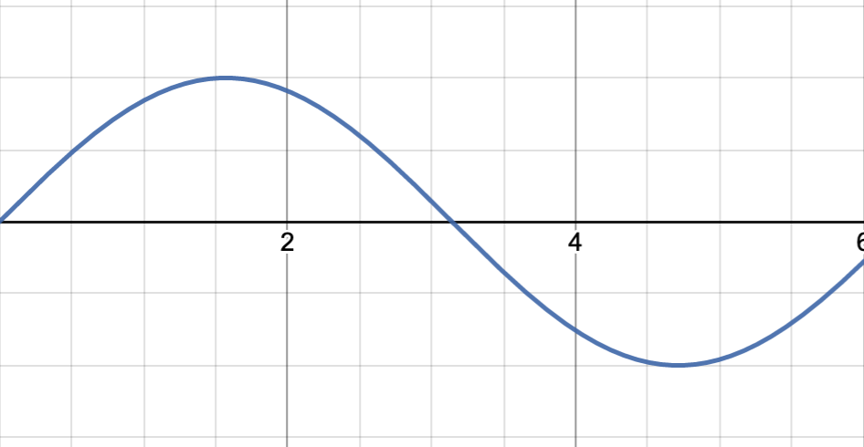

# CLASE 05/05



### PARTE PRÁCTICA

En los siguientes links se encuentra el editor con checkpoints:





### NOTAS

* [Funciones de distancia de signo:](sdfs.md)
* Funciones Circulares : [3Demo](https://circular.solsarratea.world/)

Caracterizamos a las funciones sin() y cos(), como aquellas que describen el movimiento de caminar alrededor de un círculo.&#x20;

Para ello, imaginemos que en la 3Demo arrancamos "caminando" desde el punto azul hasta el magenta, y en cada paso intermedio nos detuvimos para registrar(sacar una foto de) esa posición. En total, tardamos `16 pasos` en recorrer el círculo. &#x20;

Imaginense, que además, por cada paso(registro/foto) podemos generar un circulo sólo con la posición registrada.

Arriba a la derecha, hay un slider `step` que nos permite visibilizar de manera independiente todas las veces que nos detuvimos. Es decir, visibilizamos ahora el el tiempo (cada anillo con un único registro).&#x20;

Y si movemos este tubo tridimensional con los respectivos ejes:

 

 

En resumen, las funciones seno y coseno se las pueden pensar como las proyecciones (en los ejes  vertical y horizontal) de caminar en un círculo.&#x20;

* [Superfórmula](http://paulbourke.net/geometry/supershape/) : fórmula matemática que generaliza al Teorema de Pitágoras.\
  Se usa para describir curvas y formas en la naturaleza.

 

*   [p-normas:](https://de.wikipedia.org/wiki/P-Norm) Vimos como dibujar un círculo con la función `length(pos)= pow(pow(pos.x,2.)+pow(pos.y,2.),1./2.) .`

    Es decir, usando la noción de distancia Euclídea. Vimos como generalizando la noción de distancia, cambiandio al `2` por **`p`** se generan otras figuras.

