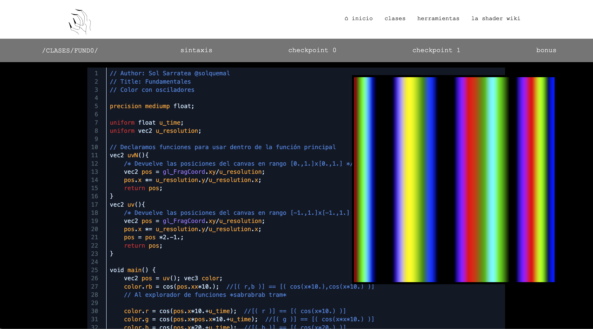

# Estructura de cada CLASE

En cada clase se encuentran las slides de presentación de contenido.

Abajo una sección **PRÁCTICA** donde hay links a clases web modulares, que usan un glslEdior. Se ve así:

Y está pensado para seguir las clases virtuales con los checkpoints escuchando las explicacioens con la posibilidad de editar el código en la misma.

Para la práctica por fuera del taller, se sugiere partir de un checkpoint y editarlo en [http://editor.thebookofshaders.com/](http://editor.thebookofshaders.com/).

Luego hay una sección **NOTAS,** con comentarios hechos en el transcurso de las clases.
