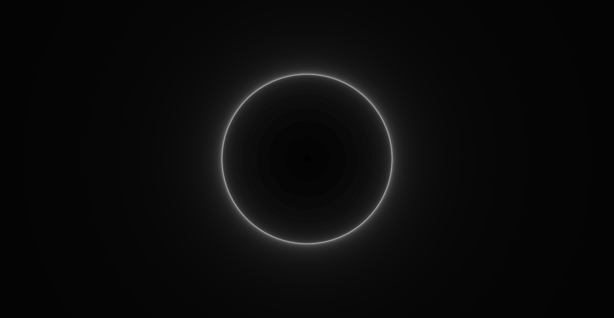
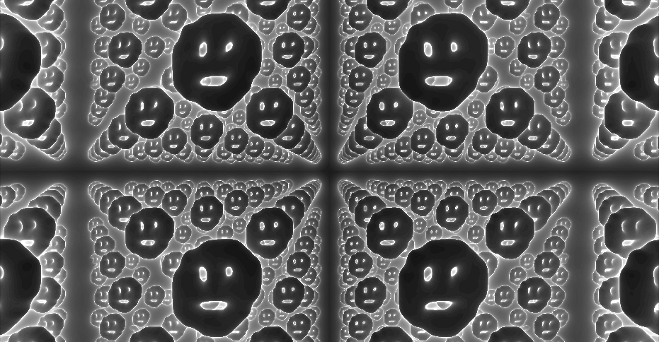

# Introducción a mundos 3D

## Objetivo

* Enteder conceptualmente la técnica de ray marching
* Divertirse dibujando

## Slides



## Script: raymarching simple

<figure><figcaption><p>Esfera simple</p></figcaption></figure>

```glsl
void main () {
    vec3 color;
    
    vec3 rd = normalize(vec3(uv(),1.5)); // Ray direction
    vec3 ro = vec3(0.,0.,-3.);         // Ray origin, podemos pensarlo donde ponemos la cámara

    float marcha; // Acumulador de las distancias calculadas
    float n;     // Acumulador para crear efecto "neon"
    
    
    for (int i=0; i<64; i++)
    {
        vec3 p =ro+marcha*rd;
        float d = length(p)-1.; // SDF para una esfera de radio 1
        
        if (d < 0.001 || marcha > 50.) {
            break;
        } 
        marcha +=d;
        n += 0.1/(.9+abs(d));
    }
 
    color +=n*0.1;
    
    gl_FragColor = vec4(color, 1.0);
}
```

### Notas

* En ray marching,  "disparamos" rayos desde la cámara (origen) hacia la escena para determinar lo que la cámara "ve".
* Cada rayo corresponde a un píxel en la pantalla, y su dirección determina hacia dónde apunta en el espacio 3D.
* La dirección del rayo:
  * necesitas proyectar el plano 2D (coordenas uv()) en el espacio 3D para determinar hacia dónde va cada rayo.
  * la **componente z** determina que tan cerca/lejos esta la proyección del espacio 2D. En otras palabras, es el **fov (campo de visión)**
  * **normalizamos** la dirección del rayo para que las direcciones sean consistentes, es decir, midan lo mismo a la hora de empezar a marchar.

## Script: BloBs!

<figure><figcaption></figcaption></figure>

```glsl
float sdEsfera(vec3 p, vec3 offset, float radio){
   return length(p-offset)-radio;
}

float map(vec3 p){
    //pR(p.xz, p.y*1.+time);// Rotacion sobre el eje y
    float d1 = sdEsfera(p, vec3(cos(time)+1., sin(time*2.), 0.),1.); 
    float d2 = sdEsfera(p, vec3(cos(time)-1.,sin(time), 0.),1.); 

   float d =  smin(d1,d2,0.9);
   //d = d + + sin(p.x*10.)*0.03; // Deformaciones sobre el borde
   return d;
}

void main () {
    vec2 pos = uv(); vec3 color;
    vec3 rd = normalize(vec3(pos,1.5));
    vec3 ro = vec3(0.,0.,-10.);

    float marcha; 
    float n;
    
    for (int i=0; i<64; i++)
    {
        vec3 p =ro+marcha*rd;
        float d = map(p); 
        
        if (d < 0.001 || marcha > 50.) {
            break;
        } 
        marcha +=d;
        n += 0.1/(.9+abs(d));
    }
    
 
    color +=n*0.1;
    
    gl_FragColor = vec4(color, 1.0);
}
```

### Notas

* Vimos como hacer distorciones:
  * &#x20;rotando al rayo antes de calcular la forma.
  * luego de calcular el valor numérico de la forma, agregar una sinusoidal (**sin()**)
* Para poder describir varios objetos tomamos el mínimo valor entre las distancias de las figuras
* **smin(d1,d2,v)** es una manera suave (smooth) de unir ambas figuras. Qué tan suave sea depende del valor de **v**, a mayor **v** "más unión".


### Script: Blobs + Canvas

<figure><figcaption></figcaption></figure>

```glsl
float sdEsfera(vec3 p, vec3 offset, float radio){
   return length(p-offset)-radio;
}

float sdfCanvas(vec3 p){
    float td = length(p-vec3(100.))-0.01;
    
    for(int i=0; i < 10; ++i){
      for(int j=0; j<10; ++j){
          vec4 s = texture2D(channel0, vec2(float(i)/10.,float(j)/10.)); 
          float x = mix(-1.,1.,float(i)/10.);
          float y = mix(-1.,1.,float(j)/10.);
          if (s.r>0.){
              float d = sdEsfera(p,vec3(x,y,0.),0.15);
               td  = smin(d,td,0.2);
          }
         
          
      }
    }
    return td;
}


float map(vec3 p){
 //repeat(p,3.);
 //repeatLimit(p,5.,3.);

  return sdfCanvas(p);
}

void main () {
    vec2 pos = uv(); vec3 color;
    vec3 rd = normalize(vec3(pos,1.5));
    vec3 ro = vec3(0.,0.,-3.);

    float marcha; 
    float n;
    
    for (int i=0; i<64; i++)
    {
        vec3 p =ro+marcha*rd;
        float d = map(p); 
        
        if (d < 0.001 || marcha > 50.) {
            break;
        } 
        marcha +=d;
        n += 0.1/(.9+abs(d));
    }
    
 
    color +=n*0.2;
    
    gl_FragColor = vec4(color, 1.0);
}
```

### Notas

* En vez de describir la escena a través de definir SDFs matemáticamente, usamos un canvas para dibujar.
  * Leemos de la textura como si fuese una grilla 10x10, cada celda dibuja una esfera en caso de ser pintada de blanco.
  * Usamos las metaballs para dibujar blobs.&#x20;
* **Bonus:** llamando las funciones **repeat()**, y **repeatLimit()** reproducimos el espacio(sistema de coordenadas) haciendo que nuestra **sdfCanvas** se repita infinitamente, o dentro de límites definidos. \
  Esto nos permite crear patrones repetitivos o estructuras periódicas en la escena sin necesidad de definir manualmente cada instancia.&#x20;

