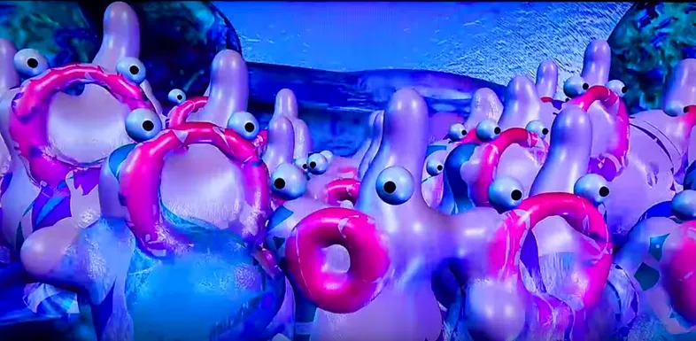

# Blobs

## La historia de "Blobs"

* **Los Metaballs** (o “blobs”) fueron desarrollados por **Jim Blinn en los años 80** para modelado de formas orgánicas y cuerpos blandos.
* El término **"blobs"** proviene de los primeros gráficos donde las formas suaves y fusionadas parecían gotas de líquido.

#### Referencias completas&#x20;



#### Jim Blinn&#x20;

<figure><figcaption>
En la serie COSMOS de Carl Sagan
</figcaption></figure>

<figure><figcaption></figcaption></figure>

<figure><figcaption></figcaption></figure>

#### Yoichiro Kawaguchi

<figure><figcaption>
Yoichiro Kawaguchi, Eggy, 1990. Still from CGM’s interview with the artist during his 2018 exhibition “L’univers des formes” at the Centre des Arts d’Enghien-les-Bains. © Gorkab. <a href="https://medium.com/danae/new-media-precursor-yoichiro-kawaguchi-351e57dbacc2">Source</a>
</figcaption></figure>


