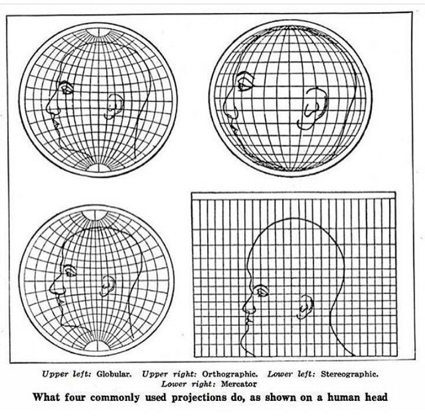
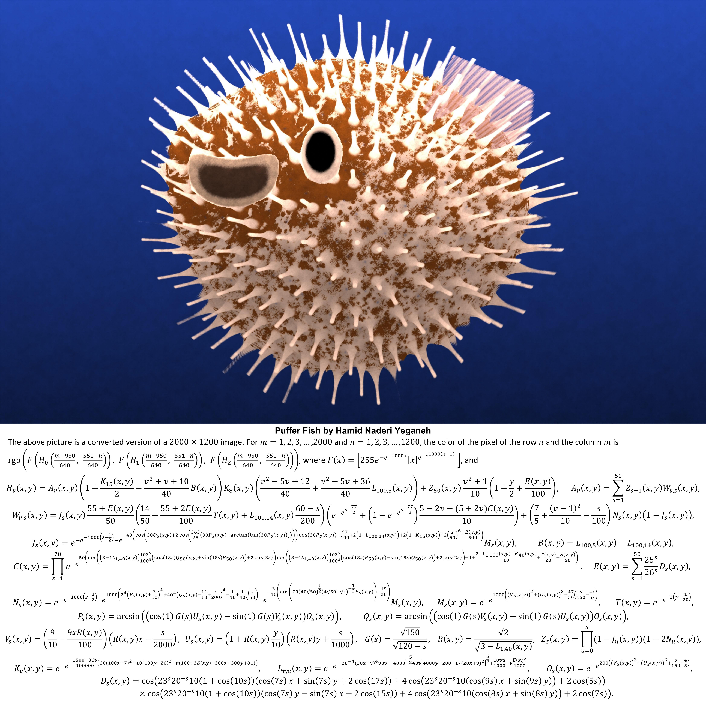

# más cositas

## Lentes de cámara

<figure><figcaption>
proyecciones en una cabza de humano
</figcaption></figure>

## Superficies&#x20;

<figure><figcaption>
curvatura negativa de una papita
</figcaption></figure>

<figure><figcaption>
<a href="https://www.instagram.com/hamidnaderiyeganeh/?hl=en">Más de su trabajo</a>
</figcaption></figure>
